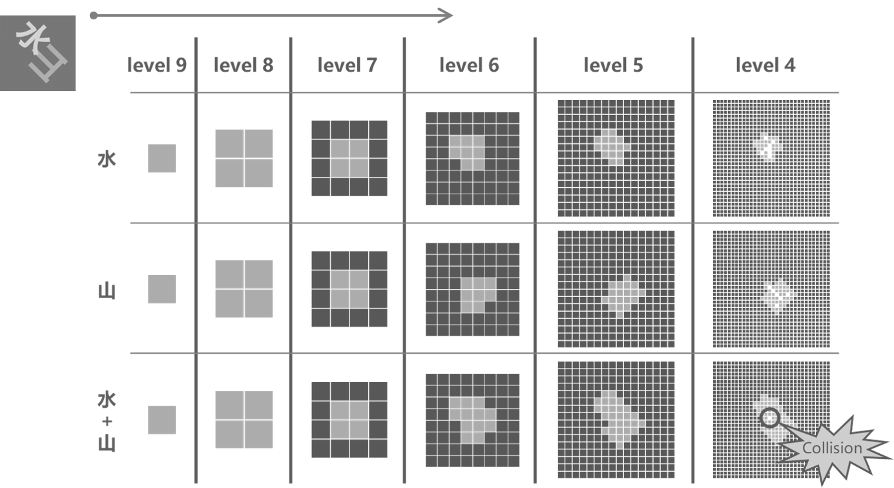

# Stuffing.jl
[](https://github.com/guo-yong-zhi/Stuffing.jl/actions/workflows/ci.yml) [](https://github.com/guo-yong-zhi/Stuffing.jl/actions/workflows/ci-nightly.yml) [](https://codecov.io/gh/guo-yong-zhi/Stuffing.jl) [](https://zenodo.org/badge/latestdoi/349631351)  
This algorithm provides a solution for **2D irregular nesting problems** (also known as cutting problems or packing problems). It is capable of processing arbitrary shapes represented by **binary or ternary raster masks** as inputs and excels in efficiently handling the nesting problems associated with numerous small objects. The implementation of this algorithm is based on quadtree and gradient optimization techniques. Additionally, it can be parallelized by launching `julia` with `julia --threads k`. This package is utilized by [WordCloud.jl](https://github.com/guo-yong-zhi/WordCloud.jl).  
Examples: [collision detection](./examples/collision.jl), [dynamic collision detection](./examples/dynamiccollisions.jl), [packing](./examples/packing.jl)  
Benchmark: [collision benchmark](./examples/collision_benchmark.jl), [fit benchmark](https://github.com/guo-yong-zhi/WordCloud.jl/blob/master/examples/benchmark.jl)  
***
```
▓▓▓▓▓▓▓▓▓▓▓▓▓▓▓▓▓▓▓▓▓▓▓▓▓▓▓▓▓▓▓▓▓▓▓▓▓▓▓▓▓▓▓▓▓▓▓▓▓▓▓▓
▓▓▓▓▓▓▓▓▓▓▓▓▓▓▓▓▓▓▓▒▒▒▒▒▒▒▒▒▒▒▒▒▒▓▓▓▓▓▓▓▓▓▓▓▓▓▓▓▓▓▓▓
▓▓▓▓▓▓▓▓▓▓▓▓▓▓▒▒▒▒▒░░░░░░░░░░░░░░▒▒▒▒▒▓▓▓▓▓▓▓▓▓▓▓▓▓▓
▓▓▓▓▓▓▓▓▓▓▓▓▒▒▒▒▒▒▒▒▒▒▒▒▒▒▒▒▒▒▒▒▒▒▒▒▒▒▒▒▓▓▓▓▓▓▓▓▓▓▓▓
▓▓▓▓▓▓▓▓▓▒▒▒▒▒▒▓▓▓▓▓▓▓▓▓▓▓▓▓▓▒▒▓▓▓▓▓▒▓▒░▒▒▓▓▓▓▓▓▓▓▓▓
▓▓▓▓▓▓▓▓▒▒▒▒▓▓▒▓▓▓▓▓▓▓▓▓▓▓▓▓▓▒▒▓▓▓▓▓▒▒▒▒▒▒▒▒▓▓▓▓▓▓▓▓
▓▓▓▓▓▓▒▒▒▓▓▓▓▓▒▓▓▓▓▓▓▓▓▓▓▓▓▓▓▒▒▓▓▓▓▓▒▒▒▓▓▓▒▒▒▒▓▓▓▓▓▓
▓▓▓▓▓▒▒░▒▓▓▓▓▓▒▓▓▓▓▓▓▓▓▓▓▓▓▓▓▒▒▓▓▓▓▓▒▓▒▓▓▓▒░▒▒▒▓▓▓▓▓
▓▓▓▓▒▒░░▒▓▓▓▓▓▒▓▓▓▓▓▓▓▓▓▓▓▓▓▓▒▒▓▓▓▓▓▒▓▒▓▓▓▒░▒▒▒▒▓▓▓▓
▓▓▓▒▒░░░▒▓▓▒▒▒▒▓▓▓▓▓▓▓▓▓▓▓▓▓▓▒▒▓▓▓▓▓▒▓▒▓▓▓▒░▒▒░▒▒▓▓▓
▓▓▒▒▒▒▒▒▒▓▓▒▓▒▒▓▓▓▓▓▓▓▓▓▓▓▓▓▓▒▒▒▒▒▒▒▒▒▒▓▓▓▒░▒▒░░▒▒▓▓
▓▓▒▒▒▓▓▓▓▓▓▒▓▒▒▓▓▓▓▓▓▓▓▓▓▓▓▓▓▒░▓▒▒▓▒▓▓▒▓▓▓▒░░░░░░▒▓▓
▓▒▒▒▒▓▓▓▓▓▓▒▒▒▒▓▓▓▓▓▓▓▓▓▓▓▓▓▓▒░▒▒▒▓▒▓▓▒▒▒▒▒▒▒▒▒▒▒▒▒▓
▓▒▒▒▒▓▓▓▓▓▓▓▓▓▓▓▓▓▓▓▓▓▓▓▓▓▓▓▓▒▒▒▒▒▒▒▒▒▒▒▒▒▒▓▓▓▓▓▓▓▒▓
▓▒▒░▒▓▓▓▓▓▓▓▓▓▓▓▓▓▓▓▓▓▓▓▓▓▓▓▓▒▓▓▓▓▓▓▓▓▓▓▓▓▒▓▓▓▓▓▓▓▒▓
▓▒▒░▒▓▓▓▓▓▓▓▓▓▓▓▓▓▓▓▓▓▓▓▓▓▓▓▓▒▓▓▓▓▓▓▓▓▓▓▓▓▒▓▓▓▓▓▓▓▒▓
▓▒▒▒▒▓▓▓▓▓▓▒▒▒▒▓▓▓▓▓▓▓▓▓▓▓▓▓▓▒▓▓▓▓▓▓▓▓▓▓▓▓▒▓▓▓▓▓▓▓▒▓
▓▒▓▓▒▓▓▓▓▓▓▒░░▒▓▓▓▓▓▓▓▓▓▓▓▓▓▓▒▓▓▓▓▓▓▓▓▓▓▓▓▒▓▓▓▓▓▓▓▒▓
▓▒▓▓▒▓▓▓▓▓▓▒▒▒▒▒▒▒▒▒▒▒▒▒▒▒▒▒▒▒▓▓▓▓▓▓▓▓▓▓▓▓▒▓▓▓▓▓▓▓▒▓
▓▒▒▒▒▓▓▓▓▓▓▒▒▓▓▓▒▓▓▓▓▓▓▓▓▓▓▓▒▒▓▓▓▓▓▓▓▓▓▓▓▓▒▓▓▓▓▓▓▓▒▓
▓▒░░▒▓▓▓▓▓▓▒▒▓▓▓▒▓▓▓▓▓▓▓▓▓▓▓▒▒▓▓▓▓▓▓▓▓▓▓▓▓▒▓▓▓▓▓▓▓▒▓
▓▒▒░▒▓▓▓▓▓▓▒▒▓▓▓▒▓▓▓▓▓▓▓▓▓▓▓▒▒▓▓▓▓▓▓▓▓▓▓▓▓▒▒▒▒▒▒▒▒▒▓
▓▓▒░▒▓▓▓▓▓▓▒▒▓▓▓▒▓▓▓▓▓▓▓▓▓▓▓▒▒▓▓▓▓▓▓▓▓▓▓▓▓▒▒▓▓▒░░▒▓▓
▓▓▒▒▒▓▓▓▓▓▓▒▒▓▓▓▒▓▓▓▓▓▓▓▓▓▓▓▒▒▓▓▓▓▓▓▓▓▓▓▓▓▒▒▓▓▒░▒▓▓▓
▓▓▓▒▒▒▒▒▒▒▒▒▓▓▓▓▒▓▓▓▓▓▓▓▓▓▓▓▒▒▓▓▓▓▓▓▓▓▓▓▓▓▒▒▓▓▒▒▒▓▓▓
▓▓▓▓▒▒░░▒▓▓▓▓▓▓▓▒▓▓▓▓▓▓▓▓▓▓▓▒▒▓▓▓▓▓▓▓▓▓▓▓▓▒▒▒▒▒▒▓▓▓▓
▓▓▓▓▓▒▒░▒▓▓▓▓▓▓▓▒▓▓▓▓▓▓▓▓▓▓▓▒▒▓▓▓▓▓▓▓▓▓▓▓▓▒▓▒▒▒▓▓▓▓▓
▓▓▓▓▓▓▒▒▒▓▓▓▓▓▓▓▒▓▓▓▓▓▓▓▓▓▓▓▒▒▓▓▒▒▒▒▒▒▒▒▒▒▒▒▒▒▓▓▓▓▓▓
▓▓▓▓▓▓▓▓▒▒▒▒▓▓▓▓▒▓▓▓▓▓▓▓▓▓▓▓▒▓▓▓▒▓▓▒░▒▓▒░░▒▒▓▓▓▓▓▓▓▓
▓▓▓▓▓▓▓▓▓▓▒▒▒▒▒▒▒▓▓▓▓▓▓▓▓▓▓▓▒▓▓▓▒▓▓▒░▒▓▒▒▒▓▓▓▓▓▓▓▓▓▓
▓▓▓▓▓▓▓▓▓▓▓▓▒▒▒▒▒▓▓▓▓▓▓▓▓▓▓▓▒▓▓▓▒▒▒▒░▒▒▒▓▓▓▓▓▓▓▓▓▓▓▓
▓▓▓▓▓▓▓▓▓▓▓▓▓▓▓▒▒▒▒▒▒▒▒▒▒▒▒▒▒▓▓▓▒▒▒▒▒▓▓▓▓▓▓▓▓▓▓▓▓▓▓▓
▓▓▓▓▓▓▓▓▓▓▓▓▓▓▓▓▓▓▓▒▒▒▒▒▒▒▒▒▒▒▒▒▒▓▓▓▓▓▓▓▓▓▓▓▓▓▓▓▓▓▓▓
▓▓▓▓▓▓▓▓▓▓▓▓▓▓▓▓▓▓▓▓▓▓▓▓▓▓▓▓▓▓▓▓▓▓▓▓▓▓▓▓▓▓▓▓▓▓▓▓▓▓▓▓
```
# Installation
```julia
import Pkg; Pkg.add("Stuffing")
```
# Algorithm Description
The algorithm consists of three main steps:
1. **Ternary Raster Pyramid Construction**: Initially, a ternary raster pyramid ([`AbstractStackedQTree`](./src/qtrees.jl)) is created for each original binary raster mask. This pyramid comprises downsampled layers of the original mask. Each subsequent layer is downsampled at a 2:1 scale. Consequently, the pyramid can be viewed as a collection of hierarchical bounding boxes. Each pixel in every layer (tree node) can take one of three values: `FULL`, `EMPTY`, or `MIX`.


2. **Top-Down Collision Detection**: The algorithm employs a top-down approach ([`collision`](./src/qtree_functions.jl)) to identify collisions between two pyramids or trees. At level 𝑙 and coordinates (𝑎,𝑏), if a node in one tree is `FULL` and the corresponding node in the other tree is not `EMPTY`, a collision occurs at (𝑙,𝑎,𝑏). However, pairwise collision detection between multiple objects would be time-consuming. To address this, the algorithm first locates the objects within hierarchical sub-regions ([`HashSpacialQTree` or `LinkedSpacialQTree`](./src/qtree.jl)). It then detects collisions between objects within each sub-region and between objects in sub-regions and their ancestral regions ([`totalcollisions_spacial`, `partialcollisions` and `locate!`](./src/qtree_functions.jl)).



3. **Object Movement and Reconstruction**: In the final step, each object in a collision pair is moved based on the local gradient ([`grad2d`](./src/fit.jl)) near the collision point (𝑙,𝑎,𝑏). The movement aims to separate the objects and create more space between them. Specifically, the objects are shifted away from the `EMPTY` regions. After moving the objects, the algorithm rebuilds the `AbstractStackedQTree`s to prepare for the next round of collision detection.


